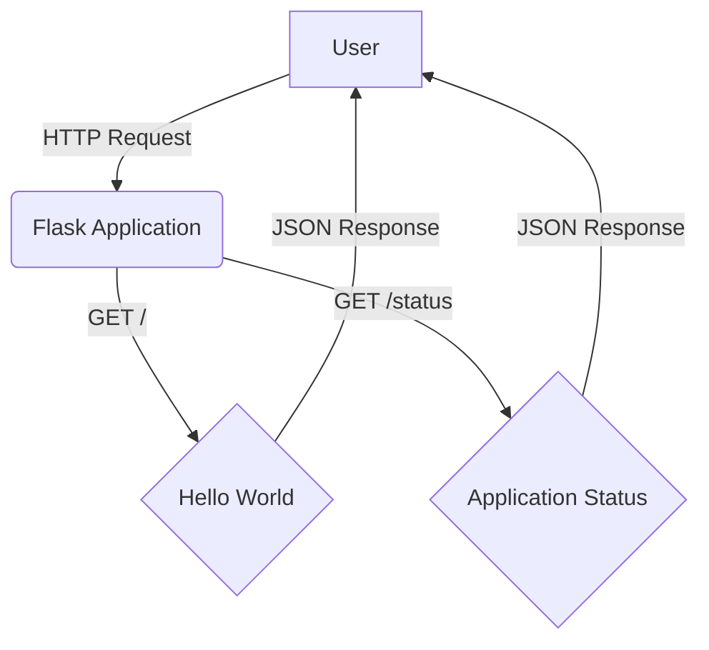
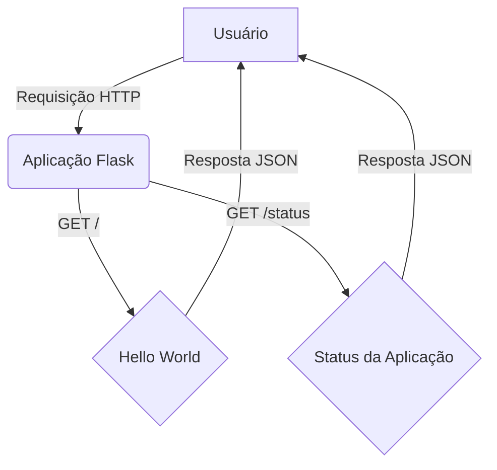

# Agile Final Project: E-commerce Product Catalog Backend

[](https://www.python.org/)
[](https://flask.palletsprojects.com/)
[](https://opensource.org/licenses/MIT)

This repository documents the Agile planning process undertaken for the development of a back-end product catalog system for an e-commerce website. The project was completed by Gabriel Demetrios Lafis as part of demonstrating proficiency in Agile methodologies, particularly Scrum and Kanban, relevant to the IBM DevOps & Software Engineering Professional Certificate.

## Project Overview and Scenario

The objective was to execute the initial Agile planning phases for a team tasked with building the core functionality of an e-commerce product catalog. This involved playing the roles of Product Owner, Scrum Master, and Developer to define requirements, build a backlog, plan a sprint, and execute the sprint using a Kanban board approach within GitHub Projects.

The core stakeholder requirements included the ability to perform CRUD operations (Create, Retrieve, Update, Delete) on products, list all products, query subsets of products, implement 'Like'/'Dislike' features, ensure cloud hosting, and establish automated deployment processes.

## Agile Process Implementation

A GitHub repository (`Agile-Final-Project`) was established to host the project artifacts. A GitHub Project board named "Final Project" was created and configured with the standard Kanban columns ('Icebox', 'Product Backlog', 'Sprint Backlog', 'In Progress', 'Review/QA', 'Done') to serve as the central board for managing the workflow.

### User Stories and Backlog Creation

Based on the stakeholder requirements, ten user stories were created as GitHub Issues within the repository. Each story followed the standard format:

```
As a [role]
I need [feature]
So that [benefit]
```

An issue template (`.github/ISSUE_TEMPLATE/user_story.md`) was created to standardize the creation of these user stories.

The initial set of issues created represented the raw requirements:

1.  **Create Product:** Ability for an administrator to add new products.
2.  **Retrieve Product:** Ability for users to view specific product details.
3.  **Update Product:** Ability for an administrator to modify existing product details.
4.  **Delete Product:** Ability for an administrator to remove products.
5.  **Like Product:** Ability for users to mark products they like.
6.  **Dislike Product:** Ability for users to mark products they dislike.
7.  **List All Products:** Ability for users to see a list of all available products.
8.  **Query Subset of Products:** Ability for users to filter or search products.
9.  **Cloud Hosting:** Requirement for the application to be hosted in the cloud.
10. **Automated Deployment:** Requirement for an automated CI/CD pipeline.

### Backlog Refinement and Prioritization

A backlog refinement meeting was conducted:

*   **Icebox:** Issues #7 (List All Products) and #8 (Query Subset of Products) were moved to the 'Icebox' column, indicating they were lower priority and not ready for immediate development.
*   **Product Backlog:** The remaining issues (#1-6, #9, #10, #11 - note: issue #10 became #11 due to a re-creation step) formed the initial 'Product Backlog'. They were ranked in the 'Product Backlog' column according to the stakeholder requirement order, with the core CRUD operations prioritized.
*   **Acceptance Criteria:** The top 5 prioritized stories in the 'Product Backlog' (#1, #2, #3, #4, #5) were refined by adding specific Acceptance Criteria using the Gherkin syntax (`Given... When... Then...`) directly into the issue descriptions.
*   **Labels:** All issues were labeled appropriately. Core features (#1-8) were labeled `enhancement`, while infrastructure/process requirements (#9, #10, #11) were labeled `technical debt`.

### Sprint Planning

A Sprint Planning meeting was held:

*   **Sprint Milestone:** A two-week sprint milestone named 'Sprint' was created.
*   **Sprint Backlog:** The top 4 prioritized and refined stories from the Product Backlog (#1, #2, #3, #4) were selected for the first sprint and moved to the 'Sprint Backlog' column.
*   **Story Points:** Story points were assigned to the sprint backlog items (#1: 3 points, #2: 5 points, #3: 2 points, #4: 3 points).
*   **Assignment:** The four sprint backlog issues were assigned to the developer (Gabriel Demetrios Lafis).

### Sprint Execution

The execution of the sprint involved moving the assigned stories across the Kanban board columns:

1.  Issue #1 (Create Product) was assigned to Gabriel Demetrios Lafis and moved from 'Sprint Backlog' to 'In Progress'.
2.  Issue #1 was moved from 'In Progress' to 'Review/QA'.
3.  Issue #2 (Retrieve Product) was assigned to Gabriel Demetrios Lafis and moved from 'Sprint Backlog' to 'In Progress'.
4.  Issue #1 was moved from 'Review/QA' to 'Done'.
5.  Issue #2 was moved from 'In Progress' to 'Review/QA'.
6.  Issue #3 (Update Product) was assigned to Gabriel Demetrios Lafis and moved from 'Sprint Backlog' to 'In Progress'.
7.  Issue #2 was moved from 'Review/QA' to 'Done'.
8.  The sprint concluded with Issue #3 remaining 'In Progress', and Issue #4 (Delete Product) still in the 'Sprint Backlog', representing work carrying over to the next sprint.

### Burndown Chart

The burndown chart for the sprint correctly displayed the progress based on the completed story points (Issues #1 and #2) against the total estimated points for the sprint.

## Conclusion

This project successfully executed the core Agile planning activities for an e-commerce backend system using GitHub Issues and Projects. The process involved creating user stories, refining a backlog, defining acceptance criteria, labeling issues, planning a sprint with estimations, and executing the sprint by moving tasks across a configured Kanban board. This exercise demonstrates a practical application of Agile principles in a software development context by Gabriel Demetrios Lafis.

## Architecture Diagram



---

# Projeto Final Ágil: Backend de Catálogo de Produtos para E-commerce

Este repositório documenta o processo de planejamento Ágil empreendido para o desenvolvimento de um sistema de catálogo de produtos de backend para um site de e-commerce. O projeto foi concluído por Gabriel Demetrios Lafis como parte da demonstração de proficiência em metodologias Ágeis, particularmente Scrum e Kanban, relevantes para o Certificado Profissional IBM DevOps & Software Engineering.

## Visão Geral e Cenário do Projeto

O objetivo foi executar as fases iniciais de planejamento Ágil para uma equipe encarregada de construir a funcionalidade central de um catálogo de produtos de e-commerce. Isso envolveu desempenhar os papéis de Product Owner, Scrum Master e Desenvolvedor para definir requisitos, construir um backlog, planejar um sprint e executar o sprint usando uma abordagem de quadro Kanban dentro do GitHub Projects.

Os requisitos principais das partes interessadas incluíam a capacidade de realizar operações CRUD (Criar, Recuperar, Atualizar, Excluir) em produtos, listar todos os produtos, consultar subconjuntos de produtos, implementar recursos de 'Curtir'/'Não Curtir', garantir hospedagem em nuvem e estabelecer processos de implantação automatizados.

## Implementação do Processo Ágil

Um repositório GitHub (`Agile-Final-Project`) foi estabelecido para hospedar os artefatos do projeto. Um quadro de Projeto GitHub chamado "Final Project" foi criado e configurado com as colunas Kanban padrão ('Icebox', 'Product Backlog', 'Sprint Backlog', 'Em Andamento', 'Revisão/QA', 'Concluído') para servir como o quadro central para gerenciar o fluxo de trabalho.

### Histórias de Usuário e Criação do Backlog

Com base nos requisitos das partes interessadas, dez histórias de usuário foram criadas como GitHub Issues dentro do repositório. Cada história seguiu o formato padrão:

```
Como um [papel]
Eu preciso [funcionalidade]
Para que [benefício]
```

Um modelo de issue (`.github/ISSUE_TEMPLATE/user_story.md`) foi criado para padronizar a criação dessas histórias de usuário.

O conjunto inicial de issues criadas representou os requisitos brutos:

1.  **Criar Produto:** Capacidade para um administrador adicionar novos produtos.
2.  **Recuperar Produto:** Capacidade para os usuários visualizarem detalhes específicos do produto.
3.  **Atualizar Produto:** Capacidade para um administrador modificar detalhes de produtos existentes.
4.  **Excluir Produto:** Capacidade para um administrador remover produtos.
5.  **Curtir Produto:** Capacidade para os usuários marcarem produtos que eles gostam.
6.  **Não Curtir Produto:** Capacidade para os usuários marcarem produtos que eles não gostam.
7.  **Listar Todos os Produtos:** Capacidade para os usuários verem uma lista de todos os produtos disponíveis.
8.  **Consultar Subconjunto de Produtos:** Capacidade para os usuários filtrarem ou pesquisarem produtos.
9.  **Hospedagem em Nuvem:** Requisito para que a aplicação seja hospedada na nuvem.
10. **Implantação Automatizada:** Requisito para um pipeline CI/CD automatizado.

### Refinamento e Priorização do Backlog

Uma reunião de refinamento do backlog foi conduzida:

*   **Icebox:** As issues #7 (Listar Todos os Produtos) e #8 (Consultar Subconjunto de Produtos) foram movidas para a coluna 'Icebox', indicando que tinham menor prioridade e não estavam prontas para desenvolvimento imediato.
*   **Product Backlog:** As issues restantes (#1-6, #9, #10, #11 - nota: a issue #10 tornou-se #11 devido a uma etapa de recriação) formaram o 'Product Backlog' inicial. Elas foram classificadas na coluna 'Product Backlog' de acordo com a ordem dos requisitos das partes interessadas, com as operações CRUD centrais priorizadas.
*   **Critérios de Aceitação:** As 5 histórias mais priorizadas no 'Product Backlog' (#1, #2, #3, #4, #5) foram refinadas adicionando Critérios de Aceitação específicos usando a sintaxe Gherkin (`Dado... Quando... Então...`) diretamente nas descrições das issues.
*   **Rótulos:** Todas as issues foram rotuladas apropriadamente. Recursos centrais (#1-8) foram rotulados `enhancement`, enquanto requisitos de infraestrutura/processo (#9, #10, #11) foram rotulados `technical debt`.

### Planejamento do Sprint

Uma reunião de Planejamento do Sprint foi realizada:

*   **Marco do Sprint:** Um marco de sprint de duas semanas chamado 'Sprint' foi criado.
*   **Sprint Backlog:** As 4 histórias mais priorizadas e refinadas do Product Backlog (#1, #2, #3, #4) foram selecionadas para o primeiro sprint e movidas para a coluna 'Sprint Backlog'.
*   **Pontos de História:** Pontos de história foram atribuídos aos itens do backlog do sprint (#1: 3 pontos, #2: 5 pontos, #3: 2 pontos, #4: 3 pontos).
*   **Atribuição:** As quatro issues do backlog do sprint foram atribuídas ao desenvolvedor (Gabriel Demetrios Lafis).

### Execução do Sprint

A execução do sprint envolveu mover as histórias atribuídas pelas colunas do quadro Kanban:

1.  A Issue #1 (Criar Produto) foi atribuída a Gabriel Demetrios Lafis e movida de 'Sprint Backlog' para 'Em Andamento'.
2.  A Issue #1 foi movida de 'Em Andamento' para 'Revisão/QA'.
3.  A Issue #2 (Recuperar Produto) foi atribuída a Gabriel Demetrios Lafis e movida de 'Sprint Backlog' para 'Em Andamento'.
4.  A Issue #1 foi movida de 'Revisão/QA' para 'Concluído'.
5.  A Issue #2 foi movida de 'Em Andamento' para 'Revisão/QA'.
6.  A Issue #3 (Atualizar Produto) foi atribuída a Gabriel Demetrios Lafis e movida de 'Sprint Backlog' para 'Em Andamento'.
7.  A Issue #2 foi movida de 'Revisão/QA' para 'Concluído'.
8.  O sprint foi concluído com a Issue #3 permanecendo 'Em Andamento', e a Issue #4 (Excluir Produto) ainda no 'Sprint Backlog', representando trabalho a ser transferido para o próximo sprint.

### Gráfico de Burndown

O gráfico de burndown para o sprint exibiu corretamente o progresso com base nos pontos de história concluídos (Issues #1 e #2) em relação aos pontos totais estimados para o sprint.

## Conclusão

Este projeto executou com sucesso as atividades centrais de planejamento Ágil para um sistema de backend de e-commerce usando GitHub Issues e Projects. O processo envolveu a criação de histórias de usuário, refinamento de um backlog, definição de critérios de aceitação, rotulagem de issues, planejamento de um sprint com estimativas e execução do sprint movendo tarefas por um quadro Kanban configurado. Este exercício demonstra uma aplicação prática dos princípios Ágeis em um contexto de desenvolvimento de software por Gabriel Demetrios Lafis.

## Diagrama de Arquitetura



## 📋 Descrição

Este repositório apresenta um projeto de backend para um catálogo de produtos de e-commerce, desenvolvido com foco em metodologias Ágeis. Ele demonstra a aplicação de Scrum e Kanban para gerenciar o ciclo de vida do desenvolvimento de software, desde a concepção de histórias de usuário até a execução de sprints. O projeto inclui uma API Flask simples para operações CRUD em produtos, com testes unitários e uma estrutura de repositório organizada.

## 🚀 Funcionalidades

*   **API RESTful:** Implementação de endpoints para gerenciar produtos (Criar, Ler, Atualizar, Excluir).
*   **Metodologias Ágeis:** Demonstração prática de Scrum e Kanban usando GitHub Issues e Projects.
*   **Testes Unitários:** Cobertura de testes para garantir a funcionalidade da API.
*   **Estrutura Profissional:** Organização clara do código e recursos em diretórios dedicados.

## 🛠️ Tecnologias Utilizadas

*   Python
*   Flask
*   GitHub Issues & Projects (para gestão Ágil)
*   Mermaid (para diagramas)

## 📦 Instalação

Para configurar e executar o projeto localmente, siga os passos abaixo:

1.  **Clone o repositório:**
    ```bash
    git clone https://github.com/galafis/Agile-Final-Project.git
    cd Agile-Final-Project
    ```
2.  **Crie e ative um ambiente virtual (recomendado):**
    ```bash
    python3 -m venv venv
    source venv/bin/activate  # No Windows use `venv\Scripts\activate`
    ```
3.  **Instale as dependências:**
    ```bash
    pip install -r requirements.txt
    ```

## 💻 Uso

1.  **Execute a aplicação Flask:**
    ```bash
    python3 src/app.py
    ```
    A API estará disponível em `http://127.0.0.1:5000/`.

2.  **Endpoints da API:**
    *   `GET /`: Retorna uma mensagem de boas-vindas.
    *   `GET /status`: Retorna o status da aplicação.

3.  **Execute os testes:**
    ```bash
    python3 -m unittest tests/test_app.py
    ```

## 📄 Licença

Este projeto está licenciado sob a Licença MIT. Veja o arquivo `LICENSE` para mais detalhes.

## 👨‍💻 Autor

**Gabriel Demetrios Lafis**

*   [GitHub](https://github.com/galafis)
*   [LinkedIn](https://www.linkedin.com/in/gabrieldemetrioslafis/)

---

*Este README foi aprimorado e traduzido por Gabriel Demetrios Lafis para melhor apresentação do projeto.*
